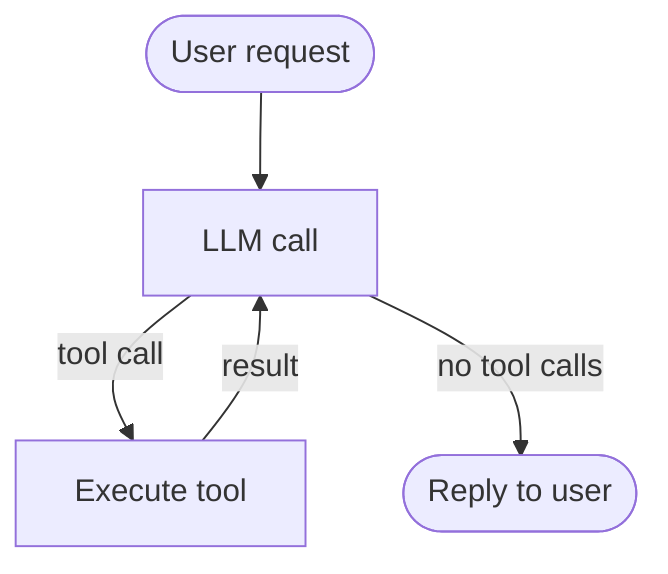

# Plan+Execute Agents — Decide Everything Upfront

_Part of the [Agent Patterns — TypeScript](../../README.md) series. If you haven't read the [ReAct post](../react/README.md) yet, start there — it covers the tool system and eval foundations this post builds on._

---

ReAct works well when each step depends on the previous result — you can't confirm a room price until you've checked availability, and you shouldn't book a room until the guest confirms. The model needs to see each result before it can decide what to do next.

But not all tasks have that dependency structure. Consider trip planning: searching for flights, hotels, attractions, and restaurants are four **independent** tasks. You don't need flight results before you can look up restaurants. There's no chain of dependencies — just a set of parallel lookups that all feed into a final synthesis.

This is where the **Plan+Execute** pattern shines.

---

## The Core Idea

Instead of one loop where the model decides each tool call after seeing the previous result, Plan+Execute separates reasoning from execution into three distinct phases:


Compare that to ReAct, where the model is in the loop for every step:



In Plan+Execute, **the plan is a first-class object** — visible, inspectable, and testable — before any tools run. Phase 2 is pure mechanical execution. No reasoning, no adaptation. The LLM is only involved twice: once to plan, once to synthesize.

---

## The Implementation

`createPlan()` is a single LLM call with `format: 'json'`:

```ts
export async function createPlan(userMessage: string): Promise<Plan> {
  const response = await ollama.chat({
    model: MODEL,
    messages: [
      { role: "system", content: PLANNER_PROMPT },
      { role: "user", content: userMessage },
    ],
    format: "json",
  });
  return JSON.parse(response.message.content) as Plan;
}
```

The planner prompt lists the available tools as plain text (no JSON schema needed — the model just needs to know what tools exist and what they do) and asks for a structured JSON plan:

```
Available tools:
- search_flights: Search for available flights between two cities on a given date.
- search_hotels: Search for hotels in a city for given dates.
- find_attractions: Find top attractions in a city.
- find_restaurants: Find restaurant recommendations in a city.

Output a JSON object with this structure:
{ "goal": "...", "steps": [{ "tool": "...", "args": {...}, "description": "..." }] }
```

`runPlanExecuteAgent()` then orchestrates all three phases:

```ts
export async function runPlanExecuteAgent(
  userMessage: string,
  history: Message[],
): Promise<Message[]> {
  // Phase 1: Plan — one LLM call, returns structured plan
  const plan = await createPlan(userMessage);
  messages.push({ role: "assistant", content: planSummary });

  // Phase 2: Execute — run each tool mechanically, no LLM involved
  for (const step of plan.steps) {
    const result = executeTripTool(step.tool, step.args);
    messages.push({ role: "tool", content: result });
  }

  // Phase 3: Synthesize — one LLM call turns results into itinerary
  const synthResponse = await ollama.chat({ model: MODEL, system: SYNTHESIZER_PROMPT, messages });
  messages.push(synthResponse.message);

  return messages;
}
```

There's no loop. The plan is fixed once it's created. If a tool fails or returns something unexpected, the synthesizer has to work with it — the plan doesn't adapt.

---

## Why This Fits Trip Planning

The trip planner's four research tasks have no dependencies between them:

- Flight results don't affect what hotels are available
- Hotel results don't affect what attractions exist
- Attraction data doesn't change what restaurants to recommend

ReAct would work here too, but at a cost: four separate LLM reasoning calls interleaved with tool execution, a longer overall latency, and a reasoning trajectory that's harder to inspect. With Plan+Execute you get a single fast planning call, parallel-ish execution, and a structured plan you can look at and test before anything runs.

The tradeoff is adaptability. If a tool returns something surprising — say, no flights available on that date — ReAct could reason about it and ask a follow-up. Plan+Execute just passes the empty result to the synthesizer and hopes it handles it gracefully. Choose based on whether your tasks have dependencies and whether mid-stream adaptation matters.

---

## Evals: Testing the Plan Before Tools Run

The most interesting property of Plan+Execute for eval design: **you can test the plan before running any tools**.

`createPlan()` is exported separately precisely for this reason. You can call it in isolation and assert on the structure of the plan — did the model include all four tools? Did it pass the right city names? — without waiting for tool execution or a final synthesized response.

```ts
evalite("Plan covers required tools", {
  data: async () => [{ input: "Plan a 3-day trip to Paris from New York, departing 2026-07-10" }],
  task: async (input) => {
    const plan = await createPlan(input);
    return plan.steps.map((s) => s.tool); // ['search_flights', 'search_hotels', ...]
  },
  scorers: [
    createScorer({
      name: "All 4 tools included",
      scorer: ({ output }) =>
        ["search_flights", "search_hotels", "find_attractions", "find_restaurants"].every((t) =>
          output.includes(t),
        )
          ? 1
          : 0,
    }),
    createScorer({
      name: "Flights before hotels",
      scorer: ({ output }) => {
        const flightIdx = output.indexOf("search_flights");
        const hotelIdx = output.indexOf("search_hotels");
        return flightIdx !== -1 && hotelIdx !== -1 && flightIdx < hotelIdx ? 1 : 0;
      },
    }),
  ],
});
```

You can also verify argument fidelity at the plan level — that the model correctly extracted the destination, dates, and origin from the user's request and routed them to the right tools:

```ts
evalite("Plan argument fidelity", {
  data: async () => [{ input: "Plan a 3-day trip to Tokyo from London, departing 2026-08-01" }],
  task: async (input) => {
    const plan = await createPlan(input);
    return plan.steps;
  },
  scorers: [
    createScorer({
      name: "search_flights destination is Tokyo",
      scorer: ({ output }) => {
        const flightStep = output.find((s) => s.tool === "search_flights");
        const dest = flightStep?.args.destination ?? "";
        return dest.toLowerCase().includes("tokyo") ? 1 : 0;
      },
    }),
  ],
});
```

This kind of eval is **only possible with Plan+Execute**. In ReAct, there's no plan object to inspect — the model makes tool call decisions one at a time, interleaved with execution. You can test the trajectory after the fact, but you can't test "was the plan sensible?" before tools ran. Separating planning from execution gives you a new testing surface that simply doesn't exist in the loop-based approach.

The third eval uses an LLM judge to score the final synthesized itinerary — same pattern as in the ReAct post:

```ts
evalite("LLM judge — itinerary quality", {
  data: async () => [{ input: "Plan a 3-day trip to Paris from New York, departing 2026-07-10" }],
  task: async (input) => {
    const history = await runPlanExecuteAgent(input, []);
    return lastAssistantMessage(history);
  },
  scorers: [
    makeOllamaJudge(
      "Itinerary includes specific details",
      "Does the itinerary include specific flight options (with airline or price), hotel recommendations (with name), and at least 3 named attractions to visit?",
    ),
  ],
});
```

---

## Key Takeaways

**Separate planning from execution when tasks are independent.** If your tool calls don't depend on each other's results, Plan+Execute gives you a faster pipeline, a structured plan you can inspect, and a new testing surface that ReAct doesn't have.

**Export `createPlan()` separately.** Making the planning step a standalone function is what enables plan-level evals. If it's buried inside the agent runner, you lose the ability to test it in isolation.

**The plan is a contract.** Once created, it's fixed. This makes the execution phase simple and fast, but means the agent can't adapt if something goes wrong. Design your tools to return useful results even in edge cases — the synthesizer is your last line of defense.

**Match the pattern to the dependency structure of the task.** ReAct shines when each step depends on the previous result. Plan+Execute is better when tasks are independent. Getting this choice right is as important as getting the implementation right.

---

## Further Reading

**The academic origin of Plan+Execute**
[Plan-and-Solve Prompting: Improving Zero-Shot Chain-of-Thought Reasoning](https://arxiv.org/abs/2305.04091) — Wang et al., ACL 2023. The paper that formalised the decompose → delegate → synthesize structure. The trip planner in this repo is a direct implementation of this pattern.

**The ReAct paper (for comparison)**
[ReAct: Synergizing Reasoning and Acting in Language Models](https://arxiv.org/abs/2210.03629) — Yao et al., 2022 (ICLR 2023). Understanding ReAct makes the tradeoffs of Plan+Execute clearer — the two papers are best read together.

**LLM-as-Judge methodology**
[Judging LLM-as-a-Judge with MT-Bench and Chatbot Arena](https://arxiv.org/abs/2306.05685) — Zheng et al. (UC Berkeley), NeurIPS 2023. The canonical paper on using an LLM to evaluate another LLM's output — the technique used in the itinerary quality eval.

**The eval runner used in this repo**
[Evalite](https://github.com/mattpocock/evalite) — Matt Pocock. TypeScript-native eval framework built on vitest. The source behind `pnpm eval` and `pnpm eval:watch`.
