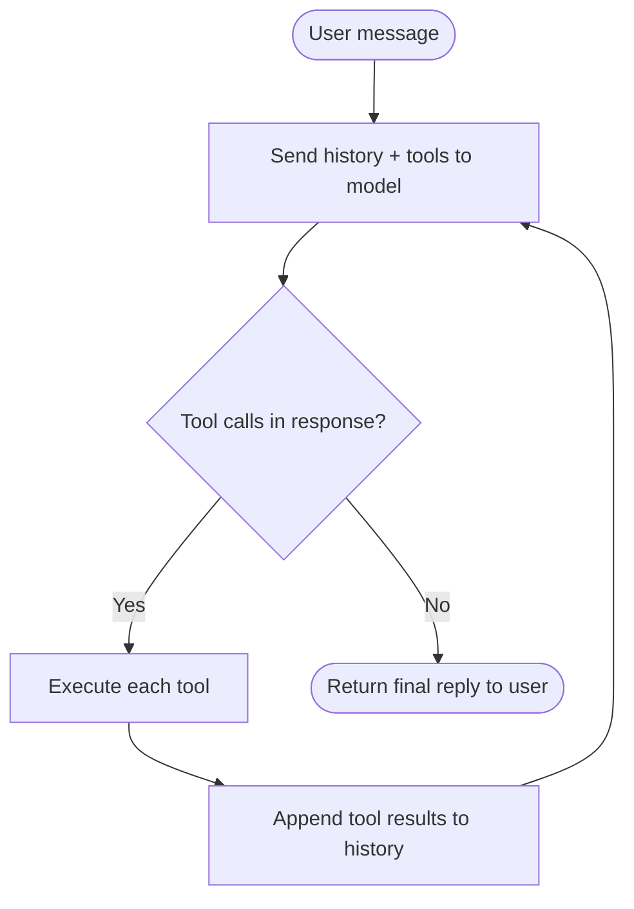
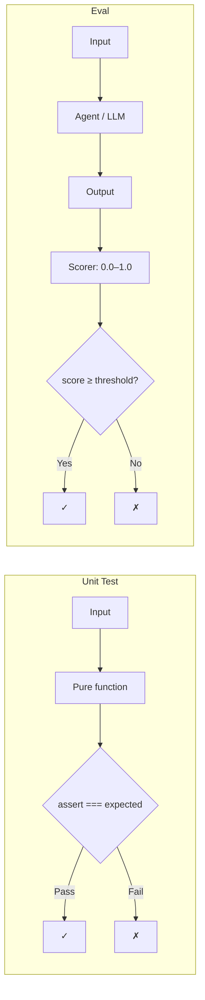
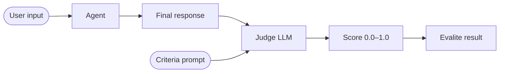

# ReAct Agents — Reason, Act, Repeat

_Part of the [Agent Patterns — TypeScript](../../README.md) series._

---

Unit tests break when you add AI. A function that routes tool calls through an LLM can't be pinned to a deterministic output — the model might phrase things differently, call tools in a different order, or reason through a problem in an unexpected way. Yet agents still need to be tested.

This post builds a hotel reservation agent using the **ReAct pattern**, then walks through two phases of eval design: simple deterministic checks (did the agent call the right tools?) up through LLM-as-judge scoring (was the final response actually good?). All evals run locally against Ollama — no API keys, no network calls.

---

## What Is a ReAct Agent?

ReAct stands for **Reason + Act**. The key insight is that you can give an LLM access to tools and put it in a loop: let it reason about what to do, act by calling a tool, observe the result, then reason again.

The loop looks like this:



There's no magic here. The entire "agent" is a `while(true)` loop in `agent.ts`:

```ts
while (true) {
  const response = await ollama.chat({ model, system, messages, tools });
  const assistantMessage = response.message;
  messages.push(assistantMessage);

  if (!assistantMessage.tool_calls || assistantMessage.tool_calls.length === 0) {
    break; // Model is done reasoning — return to user
  }

  for (const toolCall of assistantMessage.tool_calls) {
    const result = executeTool(toolCall.function.name, toolCall.function.arguments);
    messages.push({ role: "tool", content: result });
  }
  // Loop — model now reasons about the tool results
}
```

The conversation history (an array of `Message` objects) is the entire state of the agent. Each iteration adds to it; the model sees the full history on every call.

---

## Building the Tools

Every tool has two completely separate parts, and keeping them separate is one of the most important patterns in agent development:

**The definition** is a JSON schema sent to the model. It describes _what the tool does_ and _what parameters it accepts_. The model reads this and decides when and how to call the tool.

**The implementation** is the actual code that runs when the model calls the tool. The model never sees this.

```ts
// Definition — what the model sees
{
  type: 'function',
  function: {
    name: 'get_room_price',
    description: 'Get the total price for a specific room type and number of nights.',
    parameters: {
      type: 'object',
      properties: {
        room_type: { type: 'string', enum: ['single', 'double', 'suite'] },
        nights: { type: 'string', description: 'Number of nights' },
      },
      required: ['room_type', 'nights'],
    },
  },
}

// Implementation — what actually runs (model never sees this)
function getRoomPrice(args: { room_type: string; nights: string }): string {
  const price = ROOM_PRICES[args.room_type]
  const total = price * parseInt(args.nights, 10)
  return JSON.stringify({ room_type: args.room_type, pricePerNight: price, totalPrice: total })
}
```

Why does this separation matter for testing? Because when an eval fails, you immediately know whether to look at the model side (definition quality, system prompt) or the implementation (the code itself). They're independent failure modes.

---

## The System Prompt

The system prompt is where you tell the agent _how to behave_ — what order to follow steps in, what rules to enforce, how to handle edge cases. This is where most of agent reliability comes from.

```
You are a friendly hotel reservation assistant for The Grand TypeScript Hotel.

Your goal is to help guests make a room reservation. Follow these steps in order:
1. Greet the guest and ask for their name
2. Ask for their desired check-in and check-out dates
3. Use the check_availability tool to find available rooms
...
Important rules:
- Always use tools to check real availability and prices — never make up numbers
- If no rooms are available, suggest different dates
```

The ordered steps are what make Phase 1 evals meaningful. If the system prompt says "check availability before getting price", we can write a scorer that verifies `check_availability` comes before `get_room_price` in the tool call trajectory.

Changing the system prompt is a code change. It needs a test.

---

## What Are Evals?

Evals are to agents what tests are to functions — but they have to account for non-determinism, latency, and the fact that "correct" is often a spectrum rather than a binary.

The key difference from unit tests:



Evals have a **task** (run the agent), **data** (test inputs), and **scorers** (functions that return a score from 0 to 1). This structure is what [evalite](https://evalite.dev) provides — a TypeScript-native eval runner built on top of vitest.

We're testing two things:

- **Phase 1**: Did the agent use the right tools in the right order? (deterministic)
- **Phase 2**: Was the final response actually good? (LLM-as-judge)

---

## Phase 1: Deterministic Evals

The most valuable property of a tool-calling agent is that it calls the correct tools with the correct arguments. This is fully checkable without an LLM judge.

We call these **trajectory evals** — we inspect the sequence of tool calls the agent made, not just the final output.

First, some helpers in `eval-utils.ts` to extract the trajectory from the history:

```ts
// Extract ordered list of tool names — for trajectory assertions
export function extractToolCallNames(history: Message[]): string[] {
  return history
    .filter((m) => m.role === "assistant" && m.tool_calls?.length)
    .flatMap((m) => m.tool_calls!.map((tc) => tc.function.name));
}

// Extract full tool calls with arguments — for arg-level assertions
export function extractToolCalls(history: Message[]): ToolCall[] {
  return history
    .filter((m) => m.role === "assistant" && m.tool_calls?.length)
    .flatMap((m) => m.tool_calls!);
}
```

Now the eval. Each test case gives the agent a self-contained prompt with everything it needs so the full ReAct loop can complete in one `runAgent()` call:

```ts
evalite("Tool call trajectory — happy path", {
  data: async () => [
    {
      input: "My name is John Smith. Please book a double room from 2026-03-01 to 2026-03-05.",
    },
  ],
  task: async (input) => {
    const history = await runAgent(input, []);
    return extractToolCallNames(history); // returns string[]
  },
  scorers: [
    createScorer({
      name: "All tools called",
      scorer: ({ output }) =>
        ["check_availability", "get_room_price", "create_reservation"].every((t) =>
          output.includes(t),
        )
          ? 1
          : 0,
    }),
    createScorer({
      name: "Correct order",
      scorer: ({ output }) => {
        const i1 = output.indexOf("check_availability");
        const i2 = output.indexOf("get_room_price");
        const i3 = output.indexOf("create_reservation");
        return i1 !== -1 && i2 !== -1 && i3 !== -1 && i1 < i2 && i2 < i3 ? 1 : 0;
      },
    }),
  ],
});
```

A few things to notice:

1. **The task returns a typed value** (`string[]`), not the raw history. This makes scorers simple — they just work with the extracted data.

2. **Each scorer is independent**. "All tools called" can pass while "Correct order" fails, giving you precise signal about what broke.

3. **Scores are 0 or 1** here because these are binary checks. Evalite supports fractional scores (0.0–1.0) for more nuanced judgements.

We also test **argument fidelity** — that the agent passes the right values through the tool chain:

```ts
evalite("Argument fidelity — guest name and dates", {
  data: async () => [
    {
      input: "My name is Alice Johnson. I need a suite from 2026-05-10 to 2026-05-15.",
    },
  ],
  task: async (input) => {
    const history = await runAgent(input, []);
    return extractToolCalls(history); // returns ToolCall[] with full arguments
  },
  scorers: [
    createScorer({
      name: "Guest name preserved",
      scorer: ({ output }) => {
        const call = output.find((tc) => tc.function.name === "create_reservation");
        if (!call) return 0;
        const name = call.function.arguments.guest_name ?? "";
        return name.toLowerCase().includes("alice") ? 1 : 0;
      },
    }),
  ],
});
```

Guest names getting dropped or mangled is a real failure mode. A correct booking trajectory with the wrong guest name is still broken.

---

## Phase 2: LLM-as-Judge

Trajectory evals tell you _what the agent did_. They don't tell you whether the agent's response was good. For that, we need a judge.

The idea is simple: use another LLM call to evaluate the output. You write a **criteria prompt** that describes what a good response looks like, and the judge returns a score.



Since `autoevals`'s built-in `Factuality` scorer requires an OpenAI API key, we write our own judge using the same local Ollama model:

```ts
function makeOllamaJudge(name: string, criteria: string) {
  return createScorer<string, string>({
    name,
    scorer: async ({ output }) => {
      const result = await ollama.chat({
        model: MODEL,
        messages: [
          {
            role: "user",
            content: `You are evaluating a hotel reservation assistant.

Assistant's response:
"""
${output}
"""

Criteria: ${criteria}

Score 0.0-1.0. Respond with JSON only:
{ "score": <number>, "reason": "<explanation>" }`,
          },
        ],
        format: "json",
      });
      const { score } = JSON.parse(result.message.content);
      return Math.max(0, Math.min(1, score));
    },
  });
}
```

Three things make this work well:

1. **Explicit scale** — "1.0 = fully meets, 0.5 = partially, 0.0 = does not" gives the judge clear anchors.

2. **`format: 'json'`** — forcing JSON output makes parsing reliable. Without this, the model might wrap the JSON in markdown code blocks.

3. **Clamping** — `Math.max(0, Math.min(1, score))` guards against models that return values slightly outside the expected range.

Now the eval becomes:

```ts
evalite("LLM judge — reservation confirmation quality", {
  data: async () => [
    {
      input: "My name is Bob Chen. Please book a single room from 2026-06-01 to 2026-06-03.",
    },
  ],
  task: async (input) => {
    const history = await runAgent(input, []);
    return lastAssistantMessage(history); // just the text the user sees
  },
  scorers: [
    makeOllamaJudge(
      "Reservation confirmed with ID",
      "Did the assistant confirm the reservation was created and include a reservation ID starting with RES-?",
    ),
    makeOllamaJudge(
      "Guest name acknowledged",
      "Did the assistant mention the guest by name (Bob Chen)?",
    ),
  ],
});
```

**When to use LLM-as-judge vs deterministic scorers:**

| Check                                   | Use                  |
| --------------------------------------- | -------------------- |
| Did tool X get called?                  | Deterministic scorer |
| Was argument Y correct?                 | Deterministic scorer |
| Was the response helpful?               | LLM judge            |
| Did it handle the edge case gracefully? | LLM judge            |
| Did it include the right information?   | LLM judge            |

Deterministic scorers are always faster and cheaper. Use LLM judges only where you genuinely can't express the criteria as code.

---

## Running the Evals

```bash
pnpm eval          # run all evals once
pnpm eval:watch    # watch mode with UI at localhost:3006
```

Watch mode starts a local UI at `http://localhost:3006`. You get a table showing every eval, every test case, and the score from each scorer. It re-runs automatically as you edit eval files or source files.

Expected results on the first run:

- **Phase 1** — All scorers should return 1.0. If any return 0, check the tool definitions and system prompt.
- **Phase 2** — Scores should be ≥ 0.7 for the happy path. The judge is an LLM, so there's natural variance — run a few times to see the distribution.

---

## Key Takeaways

**Trajectory evals first.** Before you worry about response quality, verify the tool call sequence. It's the cheapest, most reliable signal you have.

**Test argument fidelity separately.** A correct trajectory with wrong arguments is a bug. Add at least one eval that checks the values flowing through tool calls.

**Changing the system prompt is a code change.** Every time you edit the prompt, trajectory evals give you immediate feedback on whether the agent's behaviour changed in the ways you intended.

**Use LLM judges for subjective quality.** Trajectory evals can't tell you if the final response was clear, friendly, or complete. That's what judges are for — but they're slower and less reliable, so use them sparingly.

**Local-first evals are fine.** Running `qwen2.5:7b` as both agent and judge is entirely valid for development. The model might be less capable than GPT-4, but the eval infrastructure is the same. You can swap in a stronger model when you need higher fidelity.
